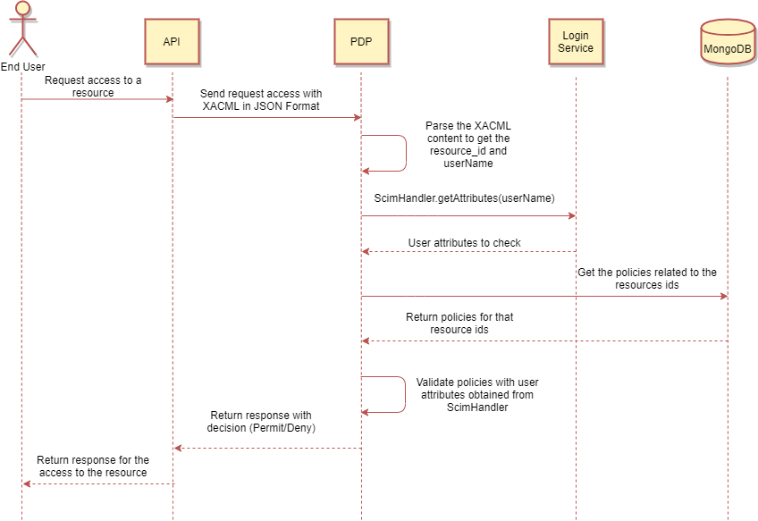

[[mainOverview]]
= Overview

== Building Block Overview

[NOTE]
.Content Description
================================
This section contains:

* High-Level Description of the Building Block
* Context within EOEPCA
================================

The main functionality of the PDP is to be able to perform complex Policy Decisions based on Policy Documents. In order to do so, several functionality blocks are identified:

* Policy Check Endpoint. A XACML-compliant endpoint that allows to submit JSON XACML requests and receive the corresponding responses.
** SCIM Client, allowing to retrieve user information that is local to the platform, whenever possible.
** OIDC Client, allowing to authenticate the component as trusted within the architecture.
** Resource API Client, allowing to retrieve details about the resources being accessed.
* Policy Repository Management. An exposed API allowing to register and/or query policies assigned to specific resources.

The PDP, when started, follows these steps:

. Load the configuration from the config file
. If no client is configured at the config file, it will register itself, using the SCIM Client
. If the PDP had to register itself, then it will save the client’s information on the config file, saving it in case a restart is needed.
. Create OIDC client
. If some policies don`t exist yet, default policies will be created and registered in a database like Mongo. This is intended as a demo registration, and can be safely deleted when not needed. Scheme of a policy in mongo: [{'_id': <mongo_i>, 'name': <policy_name>, 'description': <description>, 'config': {'resource_id': <resource_id>, 'rules': <policy_rules>}, 'scopes': <policy_scopes>}]
. Start reverse proxy using Flask and await requests

When launched, the PDP will answer to all requests to 2 specific paths:

. /policy/ and /policy/<policy_id or ObjectId(policy_id)>: To perform operations like GET/UPDATE/DELETE policies
. /policy/validate: to check the policy access to a resource using a xacml from the request
The requests should be accompained by an "Authorization: Bearer <valid_RPT>" for all endpoints except for the de /validate

Examples, given the example values of:
- path configured: "/pdp"
- PDP is at pdp.domain.com/policy
- For Validate policies : "/policy/validate"

[cols="4*"]
|===
| Token | Request to PDP | PDP Action | PDP answer

| No RPT/OAuth token | pdp.domain.com | None (request does not get to PDP endpoint) | None (the PDP doesn't see this request)
| No RPT/OAuth token and Valid data | pdp.domain.com/policy/validate with a json as data | Validates the policy access related to the json request | Return a response with Permit access 
| No RPT/OAuth token and Not valid data | pdp.domain.com/policy/validate with a json as data | Validates the policy access related to the json request | Return a response with Deny access 
| RPT/OAuth token + Policy information as data  | pdp.domain.com/policy/ | Register Policy in MongoDB | Policy_id for the policy just created 
| No RPT/OAuth token + Policy information as data | pdp.domain.com/policy/ | Register Policy in MongoDB | 401 
| RPT/OAuth token + Policy information as data | pdp.domain.com/policy/<policy_id or ObjectId(policy_id)> | Performs the operations of Get/Update/Delete policy  | Get: Return the policy Update: "updated" or "no changes made"  Delete: 204 if exists
| No RPT/OAuth token + Policy information as data | pdp.domain.com/policy/<policy_id or ObjectId(policy_id)> | Performs the operations of Get/Update/Delete policy | 401

|===

== External Interfaces

=== Exposed Interfaces

==== XACML (from/to Login Service)

The PDP exposes a policy check endpoint compliant with XACML 3.1 standards, whith a content-type application/json due to its JSON Profile.

For the function of parse XACML requests to get a decision about the access to a policy, you can use `0.0.0.0:5567/policy/validate`.

==== Resource API (to Policy Decision Point)

The PDP queries the corresponding PDP to retrieve information about a policy.
For this case we can use the `0.0.0.0:5567/policy/<policy_id or ObjectId(policy_id)>` to do all the operations related to insert, get, update and delete policies.

=== Consumed Interfaces

==== OIDC (to Login Service) 

The PDP uses the OIDC protocol in order to authenticate itself as a valid UMA client, and uses this OIDC client in all UMA-related queries.
It allows Clients to verify the identity of the End-User. (https://gluu.org/docs/gluu-server/4.0/admin-guide/openid-connect/)

These queries are done against the Login Service, and the endpoints used are:

* TYPE_OIDC
* KEY_OIDC_TOKEN_ENDPOINT
* KEY_OIDC_USERINFO_ENDPOINT

==== SCIM (to Login Service)

The PDP has the capability to auto-register itself as a client if there is no client pre-configured from previous starts or previous configuration. In order to do this, it utilizes the SCIM protocol which is designed to reduce the complexity of user management operations. (https://gluu.org/docs/gluu-server/3.1.1/user-management/scim2/)

The endpoints used for SCIM are:

* KEY_SCIM_USER_ENDPOINT
* ENDPOINT_AUTH_CLIENT_PRIVATE_KEY_JWT

== Internal Interfaces

=== MongoDB as Database

In order to access the policies, these policies will be stored in a non-relational database which will be MongoDB.
MongoDB is a cross-platform document-oriented database program, classified as a NoSQL database program. This database is characterized by storing information such as JSON-like documents with optional schemas.

== Required resources

[NOTE]
.Content Description
================================
This section contains:

* List of HW and SW required resources for the correct functioning of the building Block
* References to open repositories (when applicable)

================================

=== Software

The following Open-Source Software is required to support the deployment and integration of the Policy Enforcement Point:

* EOEPCA's SCIM Client - https://github.com/EOEPCA/um-common-scim-client
* EOEPCA's OpenID - https://github.com/EOEPCA/um-common-oidc-client
* EOEPCA's Well Known Handler - https://github.com/EOEPCA/well-known-handler
* Flask - https://github.com/pallets/flask
* MongoDB for python - https://pymongo.readthedocs.io/en/stable/index.html

== Static Architecture 

[NOTE]
.Content Description
================================
This section contains:

* Diagram and description of the major logical components within the Building Block

================================

The Policy Decision Point at this moment is composed of only one component: The reverse proxy.

The next section [Design] contains detailed descriptions and references needed to understand the intricacies of this component.

== Use cases

[NOTE]
.Content Description
================================
This section contains:

* Diagrams and definition of the use cases covered by this Building Block

================================

=== Registration of policies

The process of registering the policies is performed in the main, for this purpose the Policy_Storage class is used which will allow actions such as inserting policies in the pod where the Mongo database is located

=== Get User Attributes

(Represented in the above graph by the request to Login Service called "ScimHandler.getAttributes(userName)")

SCIM will be used in order to obtain the attributes for the user that have been extracted from the XACML of the request and then use them in the PDP functions

=== Policy Retrieval

(Represented in the above graph by the request to Mongo called "Get the policies related to the resources ids")

The PDP access through the resource id that was extracted from the XACML in the request and using the Policy_Storage class, allows to access MongoDB and extracts all the policies information stored for that resource id

=== Access Check

(Represented in the above graph by the request to PDP called "Validate policies with user attributes obtained from ScimHandler")

When the PDP has obtained the policies, we proceed to compare the content of these policies with the values obtained from the request using the ScimHandler, mainly they are the resource id and the user_name, in case that some of these do not coincide, it will be response with "Deny" in the json or with a "Permit" if everything is correct.
Now validates that the policy follows the expected structure (https://app.swaggerhub.com/apis/hector-rodriguez/PolicyAPI/1-oas3)
