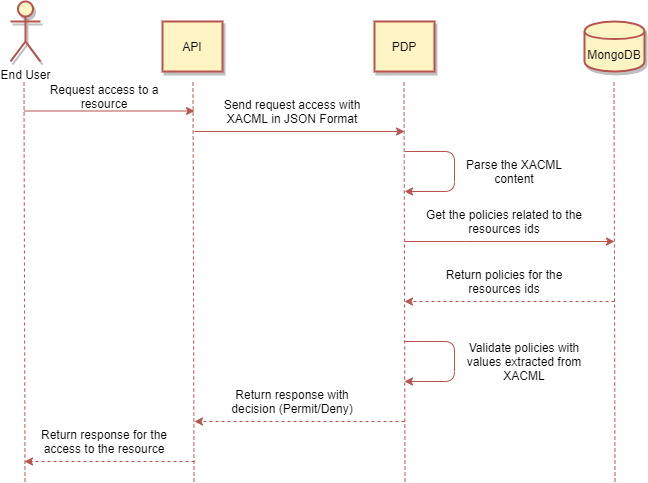

[[mainOverview]]
= Overview

== Building Block Overview

[NOTE]
.Content Description
================================
This section contains:

* High-Level Description of the Building Block
* Context within EOEPCA
================================

The main functionality of the PDP is to be able to perform complex Policy Decisions based on Policy Documents. In order to do so, several functionality blocks are identified:

* Policy Check Endpoint. A XACML-compliant endpoint that allows to submit JSON XACML requests and receive the corresponding responses.
** SCIM Client, allowing to retrieve user information that is local to the platform, whenever possible.
** OIDC Client, allowing to authenticate the component as trusted within the architecture.
** Resource API Client, allowing to retrieve details about the resources being accessed.
* Policy Repository Management. An exposed API allowing to register and/or query policies assigned to specific resources.

The PDP, when started, follows these steps:

. Load the configuration from the config file

. Insert policies using Policy_Storage class

. Start reverse proxy using Flask and await requests

When launched, the PDP will answer to all requests that start with the configured path. The request has a json that follows an xacml format where access will be requested for a resource.

== External Interfaces

=== HTTP(S) (Reverse Proxy Listener)
An HTTP listener, which can be configured through the config file.
This is the only input interface to interact directly with the PDP from outside, and is managed by the reverse proxy.

The default listener for this interface is `0.0.0.0:5567/policy/validate`.

This interface will parse accept requests to get a decision about the access to a policy.

=== XACML (from/to Login Service)

The PDP exposes a policy check endpoint compliant with XACML 3.1 standards, whith a content-type application/json due to its JSON Profile.

=== Resource API (to Policy Enforcement Point)

The PDP queries the corresponding PEP to retrieve information about a resource. 

=== OIDC (to Login Service) 

The PDP uses the OIDC protocol in order to authenticate itself as a valid UMA client, and uses this OIDC client in all UMA-related queries.

These queries are done against the Login Service, and the endpoints used are:

* TOKEN_ENDPOINT

=== SCIM (to Login Service)

The PDP has the capability to auto-register itself as a client if there is no client pre-configured from previous starts or previous configuration.

In order to do this, it utilizes the SCIM protocol, and queries the Login Service.

The endpoints used for SCIM are:

* AUTH_CLIENT_POST

=== MongoDB as Database

In order to access the policies, these policies will be stored in a non-relational database which will be MongoDB

== Required resources

[NOTE]
.Content Description
================================
This section contains:

* List of HW and SW required resources for the correct functioning of the building Block
* References to open repositories (when applicable)

================================

=== Software

The following Open-Source Software is required to support the deployment and integration of the Policy Enforcement Point:

* EOEPCA's SCIM Client - https://github.com/EOEPCA/um-common-scim-client
* EOEPCA's Well Known Handler - https://github.com/EOEPCA/well-known-handler
* Flask - https://github.com/pallets/flask
* MongoDB for python - https://pymongo.readthedocs.io/en/stable/index.html

== Static Architecture 

[NOTE]
.Content Description
================================
This section contains:

* Diagram and description of the major logical components within the Building Block

================================

The Policy Decision Point at this moment is composed of only one component: The reverse proxy.

The next section [Design] contains detailed descriptions and references needed to understand the intricacies of this component.

== Use cases

[NOTE]
.Content Description
================================
This section contains:

* Diagrams and definition of the use cases covered by this Building Block

================================

=== Registration of policies

The process of registering the policies is performed in the main, for this purpose the Policy_Storage class is used which will allow actions such as inserting policies in the pod where the Mongo database is located

=== Policy Retrieval

(Represented in the above graph by the request to Login Service called "Get the policies related to the resources ids")

The PDP access through the resource id that was extracted from the XACML in the request and using the Policy_Storage class, allows to access MongoDB and extracts all the policies information stored for that resource id

=== Access Check

(Represented in the above graph by the request to Login Service called "Validate policies with values extracted from XACML")

When the PDP has obtained the policies, we proceed to compare the content of these policies with the values obtained from the request, mainly they are the resource id and the user_name, in case that some of these do not coincide, it will be response with "Deny" in the json or with a "Permit" if everything is correct
